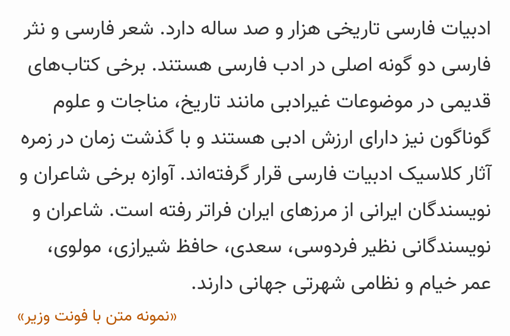

# Vazir-Font
A Persian (Farsi) Font

فونت فارسی وزیر  
[نمایش فونت - صفحه رسمی پروژه](https://rastikerdar.github.io/vazir-font/)  
[راهنمای فونت وزیر](https://github.com/rastikerdar/vazir-font/blob/master/HELP.md)  
[صفحه دریافت (دانلود) بسته فونت شامل فایل های ttf,woff,eot](https://github.com/rastikerdar/vazir-font/releases)  
با تشکر از برنامه [FontForge](https://fontforge.github.io)  
بر مبنای فونت [DejaVu Sans 2.35](https://dejavu-fonts.github.io)  
نسخه‌های بدون حروف لاتین یا تمام ارقام فارسی درون بسته فشرده موجود می‌باشد.  
فرآیند تولید بسته نهایی شامل انواع نسخه‌ها و فرمت‌ها توسط ابزار [fontbuilder](https://github.com/rastikerdar/fontbuilder) انجام می‌شود.

## نمونه متن Sample:

## طریقه استفاده در صفحات وب:

کد زیر را در قسمت style یا فایل css وارد نمایید:

## License
2015 Saber Rastikerdar ([@rastikerdar](https://github.com/rastikerdar)). See the `LICENSE` file.
